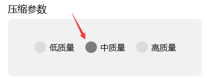

"# compressTools" 

## 本软件专为江苏省师范生培养信息系统文件上传设计

网站要求师范生提交的班团活动设计PDF单个文件大小不得超过5M，单个视频大小不得超过60M。因此本软件提供PDF压缩和视频压制两个功能。

以下为使用说明，请使用者认真阅读。

## ·PDF压缩

#### *Step1.*

点击<浏览>按钮，在弹出的文件选择对话框中选择您需要压缩的PDF文件

#### *Step2.*

在压缩参数面板中选择合适的压缩质量，现将三种压缩质量说明如下：

**低质量** - 图像为72ppi，较为模糊，大约能压缩至原始大小的50%-80%。

**中质量** - 图像为150ppi，一般清晰，大约能压缩至原始大小的70%-90%。

**高质量** - 图像为300ppi，很清晰，大约能压缩至原始大小的90%-100%。

（甚至比原始文件大）

#### *Step3.*

点击<执行压缩>按钮，选择新文件的储存路径和文件名。

#### *Step4.*

等待进度条执行到100%后，单击<确认>按钮即可。

## ·视频压缩

对于视频压缩，本软件提供两种压缩方案：

智能压缩 - 自动计算合适的视频码率、帧率和分辨率，目的是将视频压缩至60M以下，以满足师范生培养信息系统对上传文件大小的要求。

自定义压缩 - 该方案适用于对视频压制有一定经验的人使用，关于视频压制格式、帧率、码率、分辨率对压制大小的影响在此不赘述，默认使用者有一定知识储备。

#### *Step1.*

点击<浏览>按钮，在弹出的文件选择对话框中选择您需要压缩的视频文件。

#### *Step2.*

本软件提供对视频的简单编辑，可以对视频截取一个连续片段。

先简单介绍剪辑界面各个按钮的功能：

上图所示区域内，可见序号1-5所标部件，功能如下：

① - 片段截取指示标记，用于标记用户截取的片段长度与位置。

② - 视频播放进度条，用于标识视频播放的进度，以及用于标定剪辑时切入切出的位点。

③ - 标记切入点，用于标记截取片段的开始位置

④ - 播放/暂停按钮，用于控制视频的播放与暂停

⑤ - 标记切出点，用于标记截取片段的结束位置

以下详述剪辑方法：

首先点击<播放>按钮,或拖动进度条，到想要截取片段开头的位置，之后点击<标记切入点>按钮（左花括号，上图③），可见上方红色标记左端点移动到标记位置。然后再点击<播放>按钮，或拖动进度条，到想要截取片段结束的位置，之后点击<标记切出点>按钮（右花括号，上图⑤），可见上方红色标记右端点移动到标记位置。

随后请核对剪辑信息面板中的起止时刻是否合意。

#### *Step3.*

随后点击<智能压缩>单选按钮。

#### *Step4.*

随后点击<执行压缩>按钮，选择新文件的储存路径和文件名。

#### *Step5.*

等待进度条执行到100%后，单击<确认>按钮即可。

